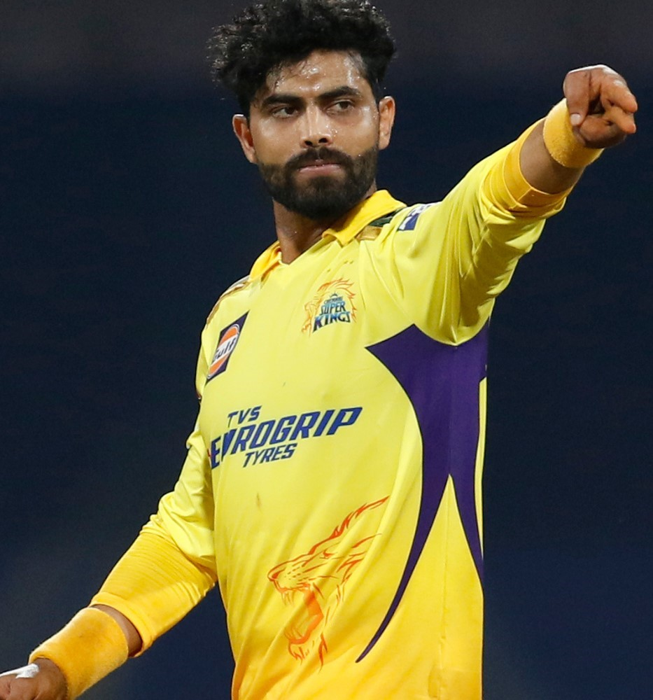
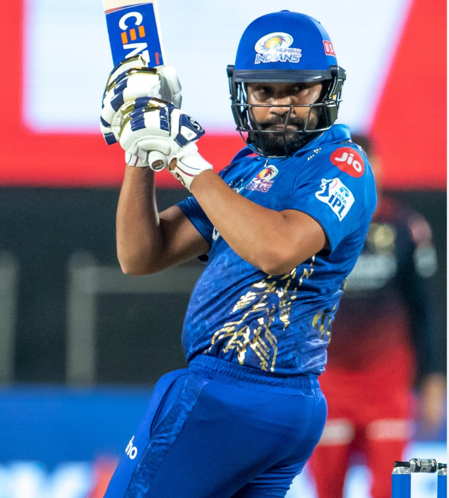

# CSS
<!DOCTYPE html>
<html>
<body style="background-color:rgb(5, 184, 201);">
<h1>

CSK💛 vs MI💙

</h1>
</body>
<body>
<h2>

<h3 style="color:rgb(247, 246, 235);">Match Start at  Today 7.30</h1>
</h2>

<h3 style ="color: violet"><a href= winn.html>
View more!
</a></h3>

</body>
</html>
